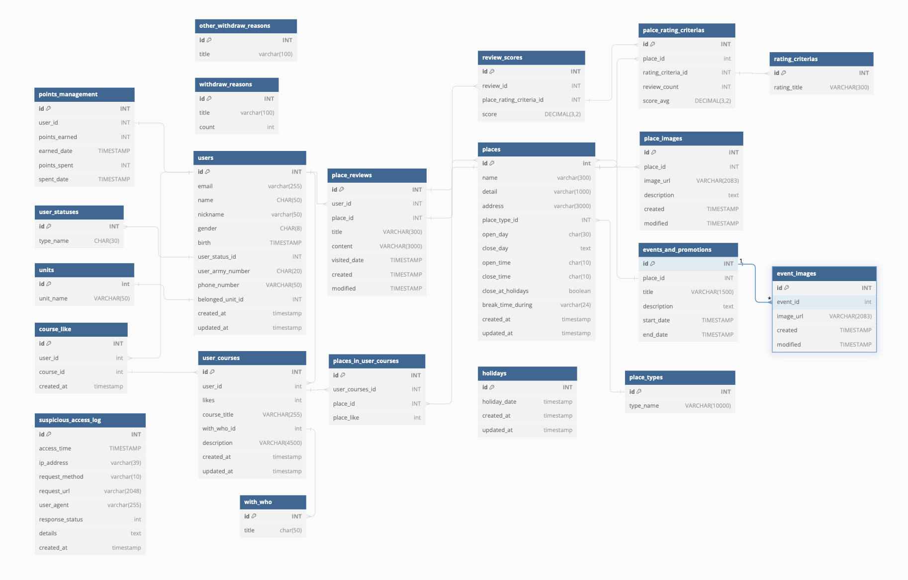

# army_venture
군인을 위한 장소 추천, 리뷰 서비스

# ERD

# API 명세
| 인덱스 | 제목                | method | API Path                           | 담당자 | 개발현황      | 토큰 |
|-------|-------------------|--------|------------------------------------|-----|-------|----|
| [회원]  |                   |        |                                    |     |       |    |
|       | 회원가입              | GET    | /signup                            | 진호  | 개발 완료 |    |
|       | 로그인               | GET    | /login                             | 진호  | 개발 완료 |    |
|       | 로그아웃              | POST   | /logout                            | 진호  | 개발 중  |    |
|       | 회원가입 리디렉션         | GET    | /signup/redirect                   | 진호  | 개발 완료 |    |
|       | 로그인 리디렉션          | GET    | /login/redirect                    | 진호  | 개발 완료 |    |
|       | 구글 로그인 요청         | POST   | /google-login                      | 진호  | 개발 완료 |    |
|       | 정보 가져오기           | GET    | /users/details                     | 지원  | 개발 완료 | O  |
|       | 회원 탈퇴 + 기타 사유     | DELETE | /users/details/withdraw            | 지원  | 개발 완료 | O  |
|       | 회원 탈퇴 + 사유        | DELETE | /users/details/withdraw            | 지원  | 개발 완료 | O  |
|       | 회원 정보 수정          | PATCH  | /users/details/                    | 지원  | 개발 완료 | O  |
| [장소]  |                   |        |                                    |     |       |    |
|       | 정보 가져오기           | GET    | /places/:placeId                   | 지원  | 개발 완료 | X  |
|       | 장소 휴일 휴무 가져오기     | GET    | /places/:placeId/holidays          | 지원  | 개발 완료 | X  |
| [리뷰]  |                   |        |                                    |     |       |    |
|       | 장소 별 리뷰 불러오기      | GET    |                                    |     |       |    |
|       | 리뷰 추가             | POST   | /places/:placeId/reviews           | 진호  | 개발 완료 |    |
|       | 리뷰 수정             | PATCH  | /places/:placeId/reviews/:reviewId | 진호  | 개발 완료 |    |
|       | 리뷰 삭제             | DELETE | /places/:placeId/reviews/:reviewId | 진호  | 개발 완료 |    |
|       | 내가 작성한 리뷰 불러오기    | GET    | /places/reviews/my                 | 진호  | 개발 완료 |    |
| [코스]  |                   |        |                                    |     |       |    |
|       | 모든 코스 불러오기        | GET    | /courses/all                       | 지원  | 개발 완료 | O  |
|       | 코스 상세 정보 가져오기     | GET    | /courses/:courseId                 | 지원  | 개발 완료 | O  |
|       | 내가 만든 코스 불러오기     | GET    | /courses/my                        | 지원  | 개발 완료 | O  |
|       | 내가 담은 코스 불러오기     | GET    | /courses/my/likes                  | 지원  | 개발 완료 | O  |
|       | 코스 동행자별 정렬하여 불러오기 | GET    | /courses/with/:withWhoId           | 지원  | 개발 완료 | O  |
|       | 코스 생성하기           | POST   | /courses                           | 지원  | 개발 완료 | O  |
|       | 코스 좋아요 하기         | POST   | /courses/:courseId/likes           | 지원  | 개발 완료 | O  |
|       | 코스 정보 수정하기        | PATCH  | /courses/:courseId                 | 지원  | 개발 완료 | O  |
|       | 코스에 장소 추가하기       | POST   | /courses/:courseId/place           | 지원  | 개발 완료 | O  |
|       | 코스 내 장소 삭제        | DELETE | /courses/:courseId/place/:placeId  | 지원  | 개발 완료 | O  |
|       | 코스 삭제             | DELETE | /courses/:courseId                 | 지원  | 개발 완료 | O  |
|       | 코스 좋아요 철회         | DELETE | /courses/:courseId/likes           | 지원  | 개발 완료 | O  |
| [이벤트] |                   |        |                                    |     |       |    |
|       | 모든 이벤트 불러오기       | GET    | /events/all                        | 지원  | 수정 필요 | X  |
|       | 이벤트 정보 가져오기       | GET    | /events/:eventId                   | 지원  | 수정 필요 | X  |
